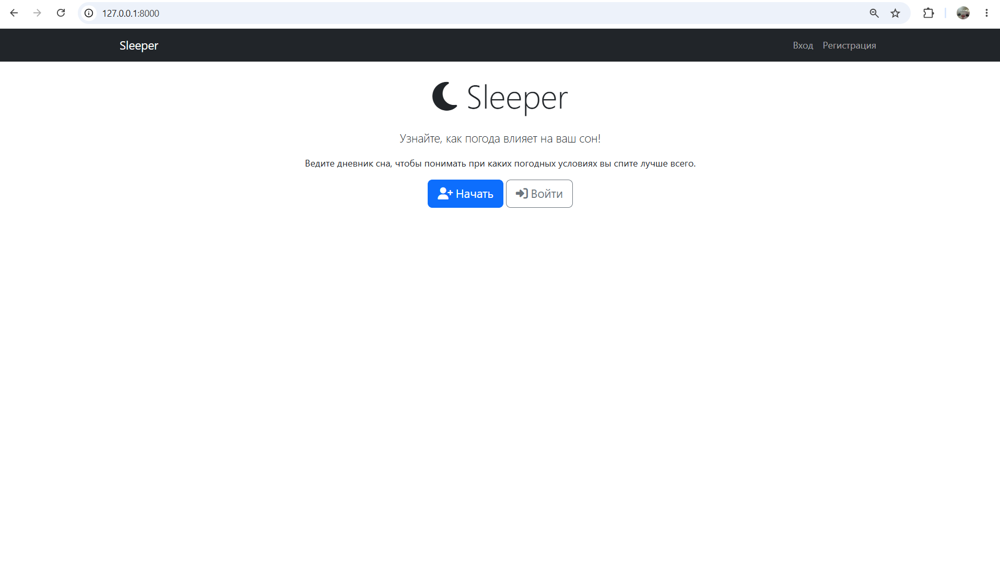
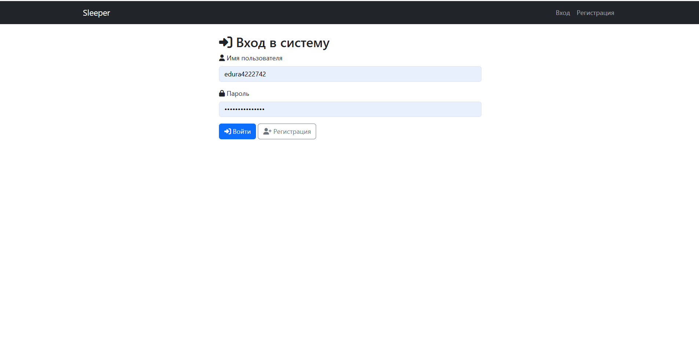
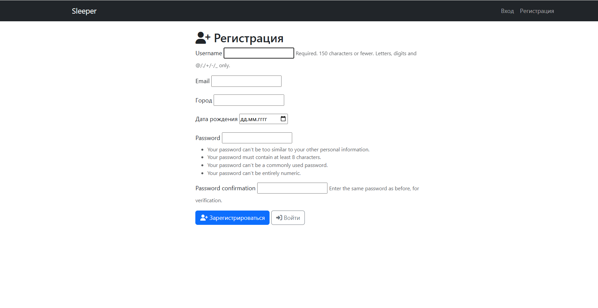
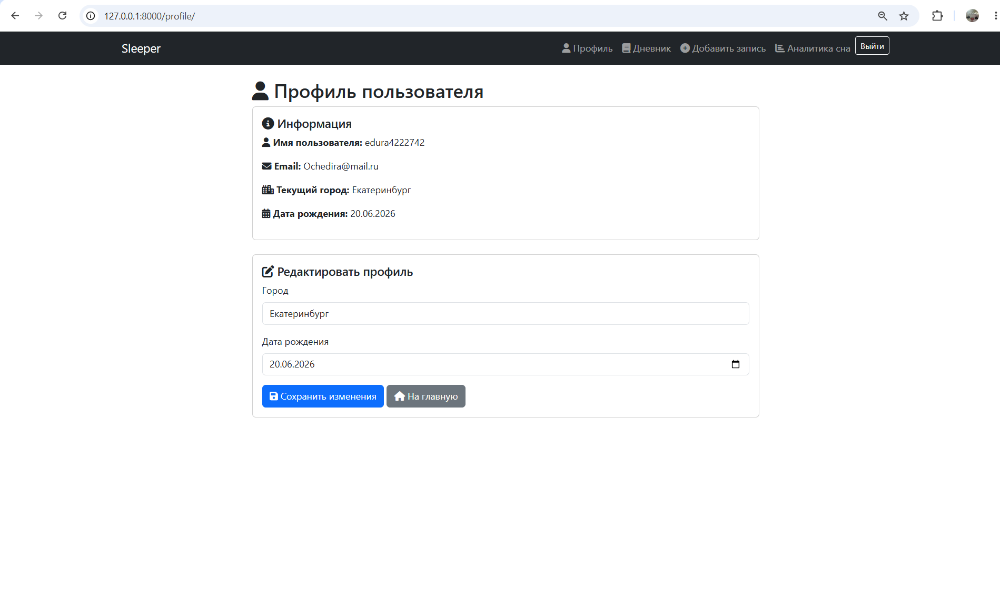
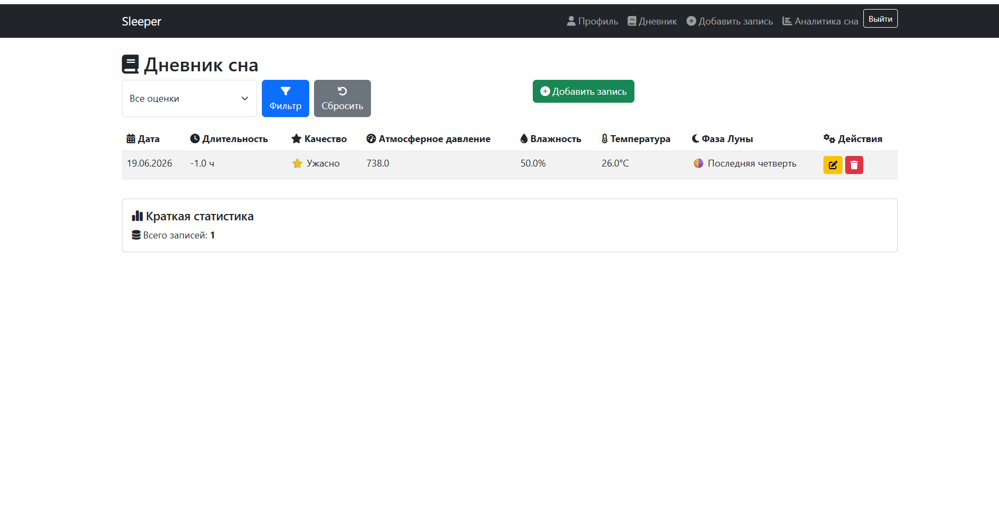
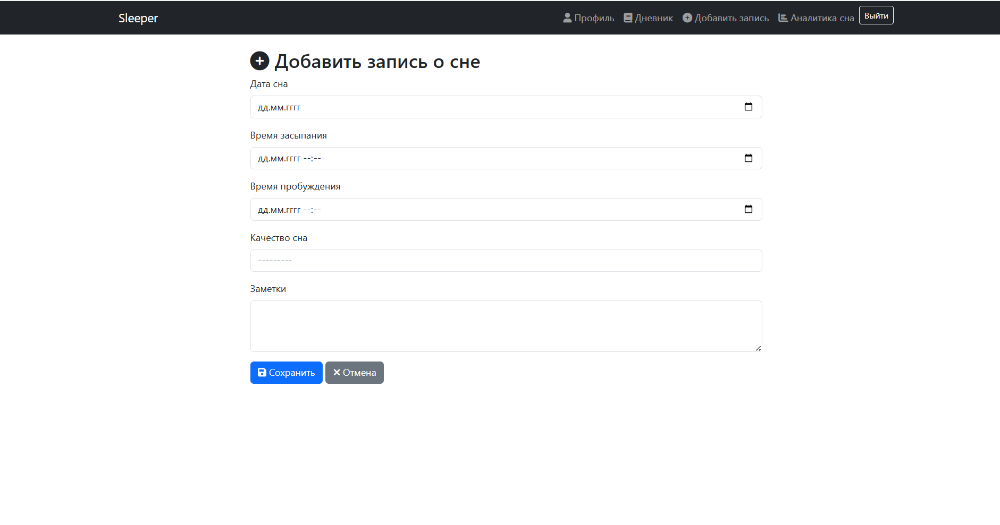
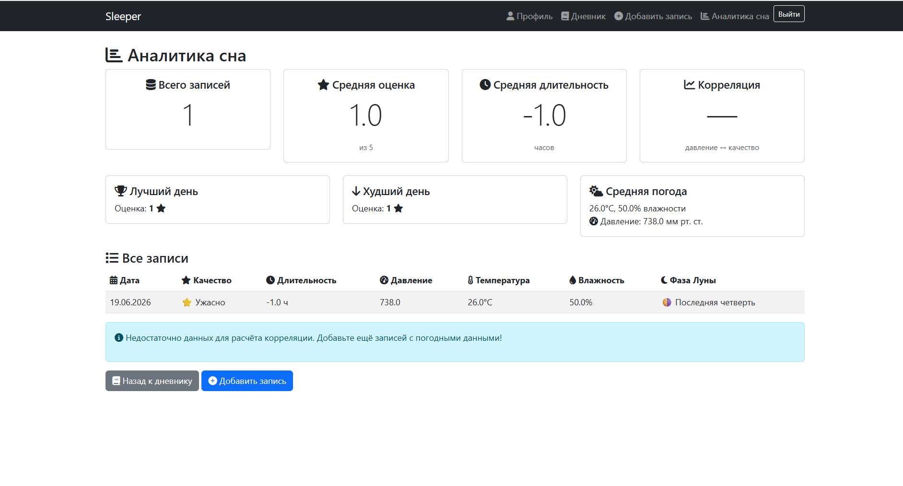

# Sleeper

это веб-сервис для метеозависимых людей, который помогает выявить связь между погодными условиями (атмосферное давление, температура, влажность, фаза Луны) и качеством сна.

**Демо-версия:** http://127.0.0.1:8000/

## Стек технологий
 - **Backend:** Python 3.13, Django 6.0
 - **API:** Яндекс Погода
 - **Analytics:** Pandas
 - **Frontend:** Bootstrap 5.3, Font Awesome 6.4, HTML5, CSS3
 - **Database:** SQLite (Dev)

## Интерфейс
**1. Главная страница:**  
**2. Вход:** 
**3. Регистрация:**
**4. Профиль пользователя:** 
**5. Дневник сна:** 
**6. Добавление записи:** 
**7. Аналитика сна:**

## Как запустить проект локально:

**1. Клонируйте репозиторий:**
```bash
  git clone https://github.com/ваш-логин/sleepsense-analyzer.git
  cd sleepsense-analyzer
```
**2. Создайте и активируйте виртуальное окружение:**
```bash
python -m venv venv             # Windows
venv\Scripts\activate

python3 -m venv venv            # Mac / Linux
source venv/bin/activate
```

**3. Установите зависимости:**
```bash
pip install -r requirements.txt
```
**4. Создайте файл .env с API-ключом:**
```bash
echo "YANDEX_API_KEY=ваш_ключ_здесь" > .env
```
**5. Выполните миграции:**
```bash
python manage.py migrate
```
**6. Создайте суперпользователя:**
```bash
python manage.py createsuperuser
```
**7. Запустите сервер:**
```bash
python manage.py runserver
```
**8. Откройте проект в браузере:**

Перейдите по ссылке: http://127.0.0.1:8000
